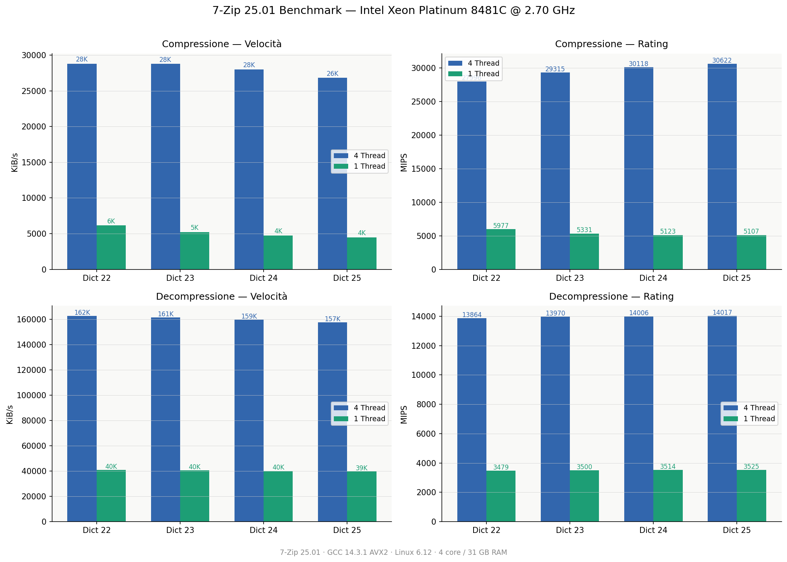
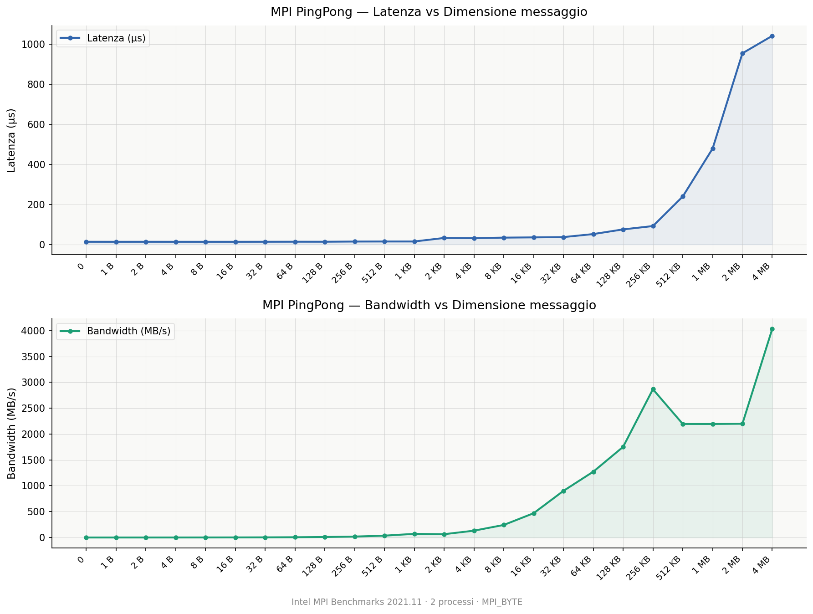

# Conway's Game of Life - Programmazione Concorrente, Parallela e su Cloud


```c
void partition_dimension(uint32_t total, int parts, int *sizes, int *offsets) {
    uint32_t q = total / (uint32_t)parts;
    uint32_t r = total % (uint32_t)parts;
    uint32_t small = (uint32_t)parts - r;
    uint32_t curr_offset = 0;

    for (int i = 0; i < parts; i++) {
        sizes[i] = (int)((uint32_t)i < small ? q : q + 1);
        if (offsets != NULL) {
            offsets[i] = (int)curr_offset;
        }
        curr_offset += (uint32_t)sizes[i];
    }
}
```

```c
void read_matrix_from_file(void *out_matrix, int *sizes, int *subsizes, int *starts) {
#ifdef _WIN32
    FILE *fp = _fsopen(filename, "rb", _SH_DENYNO);
#else
    FILE *fp = fopen(filename, "rb");
#endif
    if (!fp) {
        MPI_Abort(MPI_COMM_WORLD, EXIT_FAILURE);
    }

    int starts_r_offset = starts[0];
    int starts_c_offset = starts[1];
    int size_c = sizes[1];
    int M = subsizes[0];
    int N = subsizes[1];

    uint8_t (*matrix)[N] = (uint8_t (*)[N])out_matrix;

    for (int i = 0; i < M; i++) {
        long long offset = ((long long)(starts_r_offset + i) * size_c + starts_c_offset) * sizeof(uint8_t);
#ifdef _WIN32
        _fseeki64(fp, (__int64)offset, SEEK_SET);
#else
        fseeko(fp, (off_t)offset, SEEK_SET);
#endif
        fread(matrix[i], sizeof(uint8_t), N, fp);
    }

    fclose(fp);
}
```

```c
void async_recv_top_bottom(MPI_Comm comm, Game_matrix *gm, int top_rank, int bot_rank, MPI_Request req[2]) {
    req[0] = MPI_REQUEST_NULL;
    req[1] = MPI_REQUEST_NULL;
    if (top_rank != MPI_PROC_NULL) {
        MPI_Irecv(gm->recv_t_ghost, (int)gm->size.cols, MPI_UINT8_T, top_rank, 1, comm, &req[0]);
    }
    if (bot_rank != MPI_PROC_NULL) {
        MPI_Irecv(gm->recv_b_ghost, (int)gm->size.cols, MPI_UINT8_T, bot_rank, 1, comm, &req[1]);
    }
}
```

```c
void run_worker(int mpi_dims[2], MPI_Comm split_comm, int sizes[2], int subsizes[2], int starts[2]) {
    int w_rank;
    MPI_Comm_rank(split_comm, &w_rank);

    MPI_Comm cart_comm;
    MPI_Cart_create(split_comm, 2, mpi_dims, (int[]){0, 0}, 0, &cart_comm);

    uint32_t local_rows = (uint32_t)subsizes[0];
    uint32_t local_cols = (uint32_t)subsizes[1];

    if (local_rows == 0 || local_cols == 0) {
        MPI_Abort(MPI_COMM_WORLD, EXIT_FAILURE);
    }

    uint8_t (*local_grid)[local_cols] = malloc(sizeof(uint8_t[local_rows][local_cols]));
    if (!local_grid) {
        MPI_Abort(MPI_COMM_WORLD, EXIT_FAILURE);
    }

    read_matrix_from_file(local_grid, sizes, subsizes, starts);

    uint8_t *recv_l_ghost = calloc(local_rows + 2, sizeof(uint8_t));
    uint8_t *recv_r_ghost = calloc(local_rows + 2, sizeof(uint8_t));
    uint8_t *recv_t_ghost = calloc(local_cols, sizeof(uint8_t));
    uint8_t *recv_b_ghost = calloc(local_cols, sizeof(uint8_t));
    
    uint8_t *send_l_buf   = malloc((local_rows + 2) * sizeof(uint8_t));
    uint8_t *send_r_buf   = malloc((local_rows + 2) * sizeof(uint8_t));
    
    uint8_t (*next_local_grid)[local_cols] = malloc(sizeof(uint8_t[local_rows][local_cols]));

    if (!recv_l_ghost || !recv_r_ghost || !recv_t_ghost || !recv_b_ghost || !send_l_buf || !send_r_buf || !next_local_grid) {
        MPI_Abort(MPI_COMM_WORLD, EXIT_FAILURE);
    }

    Game_matrix gm = {
        .size         = { local_rows, local_cols },
        .matrix       = local_grid,
        .recv_l_ghost = recv_l_ghost,
        .recv_r_ghost = recv_r_ghost,
        .recv_t_ghost = recv_t_ghost,
        .recv_b_ghost = recv_b_ghost,
    };

    int top_rank, bot_rank, left_rank, right_rank;
    MPI_Cart_shift(cart_comm, 0, 1, &top_rank, &bot_rank);
    MPI_Cart_shift(cart_comm, 1, 1, &left_rank, &right_rank);

    MPI_Request req_recv_tb[2], req_send_tb[2];
    MPI_Request req_recv_lr[2], req_send_lr[2];
    MPI_Status  mpi_stats[2];

    for (int g = 0; g < N_GEN; g++) {
        async_recv_top_bottom(cart_comm, &gm, top_rank, bot_rank, req_recv_tb);
        async_send_top_bottom(cart_comm, &gm, top_rank, bot_rank, req_send_tb);

        for (uint_fast32_t r = 1; r + 1 < local_rows; r++) {
            for (uint_fast32_t c = 1; c + 1 < local_cols; c++) {
                play_inner_cells(gm.matrix, next_local_grid, r, c, local_cols);
            }
        }

        MPI_Waitall(2, req_recv_tb, mpi_stats);
        MPI_Waitall(2, req_send_tb, mpi_stats);

        pack_left_right_send_buffers(&gm, send_l_buf, send_r_buf);
        
        async_recv_left_right(cart_comm, &gm, left_rank, right_rank, req_recv_lr);
        async_send_left_right(cart_comm, &gm, left_rank, right_rank, send_l_buf, send_r_buf, req_send_lr);

        MPI_Waitall(2, req_recv_lr, mpi_stats);
        MPI_Waitall(2, req_send_lr, mpi_stats);

        for (uint_fast32_t c = 0; c < local_cols; c++) {
            play_border_cells(&gm, next_local_grid, 0, c);
            if (local_rows > 1) {
                play_border_cells(&gm, next_local_grid, local_rows - 1, c);
            }
        }
        
        for (uint_fast32_t r = 1; r + 1 < local_rows; r++) {
            play_border_cells(&gm, next_local_grid, r, 0);
            if (local_cols > 1) {
                play_border_cells(&gm, next_local_grid, r, local_cols - 1);
            }
        }

        void *tmp_ptr   = gm.matrix;
        gm.matrix       = next_local_grid;
        next_local_grid = tmp_ptr;
    }

    
    if (SAVE_OUTPUT) {
        MPI_Datatype file_type;
        MPI_Type_create_subarray(2, sizes, subsizes, starts,
                             MPI_ORDER_C, MPI_UINT8_T, &file_type);
        MPI_Type_commit(&file_type);
        MPI_File fh;
        MPI_File_open(cart_comm, "full_matrix.bin", 
                      MPI_MODE_CREATE | MPI_MODE_WRONLY, MPI_INFO_NULL, &fh);
                      MPI_File_set_view(fh, 0, MPI_UINT8_T, file_type, "native", MPI_INFO_NULL);

        MPI_File_write_all(fh, gm.matrix, local_rows * local_cols, MPI_UINT8_T, MPI_STATUS_IGNORE);
    
        MPI_File_close(&fh);
        MPI_Type_free(&file_type);
    }

    free(recv_l_ghost);
    free(recv_r_ghost);
    free(recv_t_ghost); 
    free(recv_b_ghost);
    free(send_l_buf);
    free(send_r_buf);
    free(next_local_grid);
    free(gm.matrix);
    
    MPI_Comm_free(&cart_comm);
}
```

```c
void run_master(int mpi_dims[2], MPI_Comm split_comm, uint32_t M, uint32_t N, int sizes[2], int subsizes[2], int starts[2]) {
    int row_sizes[mpi_dims[0]], row_offsets[mpi_dims[0]];
    int col_sizes[mpi_dims[1]], col_offsets[mpi_dims[1]];
    
    partition_dimension(M, mpi_dims[0], row_sizes, row_offsets);
    partition_dimension(N, mpi_dims[1], col_sizes, col_offsets);

    sizes[0] = (int)M; 
    sizes[1] = (int)N;

    int compute_sz;
    MPI_Comm_size(split_comm, &compute_sz);

    for (int i = 1; i < compute_sz; i++) {
        int r_idx = i / mpi_dims[1];
        int c_idx = i % mpi_dims[1];
        
        int sub[2] = { row_sizes[r_idx], col_sizes[c_idx] };
        int st[2]  = { row_offsets[r_idx], col_offsets[c_idx] };

        MPI_Send(sizes, 2, MPI_INT, i, 0, split_comm);
        MPI_Send(sub, 2, MPI_INT, i, 1, split_comm);
        MPI_Send(st, 2, MPI_INT, i, 2, split_comm);
    }

    subsizes[0] = row_sizes[0];
    subsizes[1] = col_sizes[0];
    starts[0]   = row_offsets[0];
    starts[1]   = col_offsets[0];
}
```

```c
int main(int argc, char **argv) {
    uint32_t M = 10000;
    uint32_t N = 10000;
    
    parse_args(argc, argv, &M, &N);

    MPI_Init(&argc, &argv);
    MPI_Barrier(MPI_COMM_WORLD);
    double start_time = MPI_Wtime();

    int rank, num_procs;
    MPI_Comm_rank(MPI_COMM_WORLD, &rank);
    MPI_Comm_size(MPI_COMM_WORLD, &num_procs);

    int compute_sz = num_procs;
    while (compute_sz > 1 && !is_min_size((uint32_t)compute_sz, M, N)) {
        compute_sz--;
    }

    int mpi_dims[2] = {0, 0};
    MPI_Dims_create(compute_sz, 2, mpi_dims);

    if (mpi_dims[0] <= 0 || mpi_dims[1] <= 0) {
        MPI_Abort(MPI_COMM_WORLD, EXIT_FAILURE);
    }

    int split_color = (rank < compute_sz) ? 1 : MPI_UNDEFINED;
    MPI_Comm split_comm;
    MPI_Comm_split(MPI_COMM_WORLD, split_color, rank, &split_comm);

    if (split_comm != MPI_COMM_NULL) {
        int sizes[2], subsizes[2], starts[2];

        if (rank == 0) {
            run_master(mpi_dims, split_comm, M, N, sizes, subsizes, starts);
        } else {
            MPI_Recv(sizes, 2, MPI_INT, 0, 0, split_comm, MPI_STATUS_IGNORE);
            MPI_Recv(subsizes, 2, MPI_INT, 0, 1, split_comm, MPI_STATUS_IGNORE);
            MPI_Recv(starts, 2, MPI_INT, 0, 2, split_comm, MPI_STATUS_IGNORE);
        }

        run_worker(mpi_dims, split_comm, sizes, subsizes, starts);
        MPI_Comm_free(&split_comm);
    }

    TimeRankPair local_time = { MPI_Wtime() - start_time, rank };
    TimeRankPair max_time;
    
    MPI_Reduce(&local_time, &max_time, 1, MPI_DOUBLE_INT, MPI_MAXLOC, 0, MPI_COMM_WORLD);

    if (rank == 0) {
        printf("Max Time: %f s (Rank: %d)\n", max_time.time, max_time.rank);
    }

    MPI_Finalize();
    return 0;
}
```

```c
void write_matrix_to_file_fast(uint32_t M, uint32_t N) {
    char filename[256];
    sprintf(filename, "matrix_%ux%u_seed%u_pattern%d.bin", M, N, SEED, PATTERN);
    FILE *fp = fopen(filename, "wb");
    if (!fp) {
        perror("Errore nell'apertura del file");
        exit(EXIT_FAILURE);
    }

    uint8_t *row_buffer = calloc(N, sizeof(uint8_t));
    if (!row_buffer) {
        printf("Errore di allocazione memoria\n");
        exit(EXIT_FAILURE);
    }

    if (PATTERN == 0) srand(SEED);

    for (uint32_t r = 0; r < M; r++) {
        if (PATTERN != 0) {
            memset(row_buffer, 0, N * sizeof(uint8_t));
        }

        if (PATTERN == 0) {
            for (uint32_t c = 0; c < N; c++) {
                row_buffer[c] = (rand() % 2 == 0);
            }
        } else if (PATTERN == 1 && r < 3 && M >= 3 && N >= 3) {
            // Glider top left
            if (r == 0) { row_buffer[1] = 1; }
            else if (r == 1) { row_buffer[2] = 1; }
            else if (r == 2) { row_buffer[0] = 1; row_buffer[1] = 1; row_buffer[2] = 1; }
        } else if (PATTERN == 2 && M >= 3 && N >= 3) {
            // Blinker center
            if (r == M / 2) { row_buffer[N / 2 - 1] = 1; row_buffer[N / 2] = 1; row_buffer[N / 2 + 1] = 1; }
        } else if (PATTERN == 3 && M >= 2 && N >= 2) {
            // Block center
            if (r == M / 2 || r == M / 2 + 1) { row_buffer[N / 2] = 1; row_buffer[N / 2 + 1] = 1; }
        }

        fwrite(row_buffer, sizeof(uint8_t), N, fp);
    }

    free(row_buffer);
    fclose(fp);
    
    const char* pattern_names[] = {"Random", "Glider", "Blinker", "Block"};
    printf("Matrice %u x %u scritta su %s (Pattern: %s)\n", M, N, filename, pattern_names[PATTERN]);
}
```




